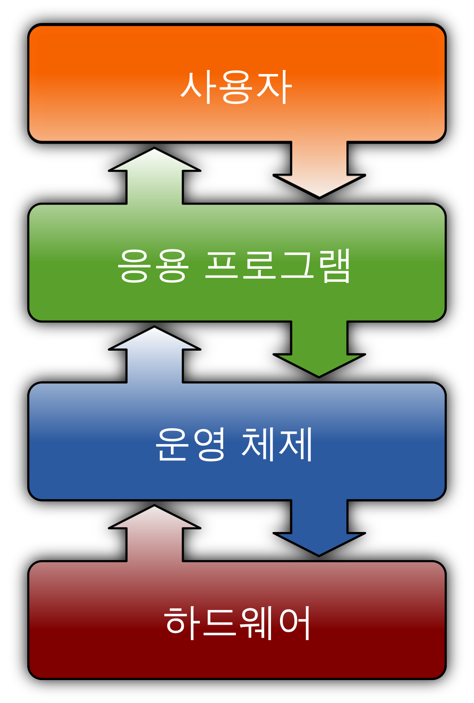
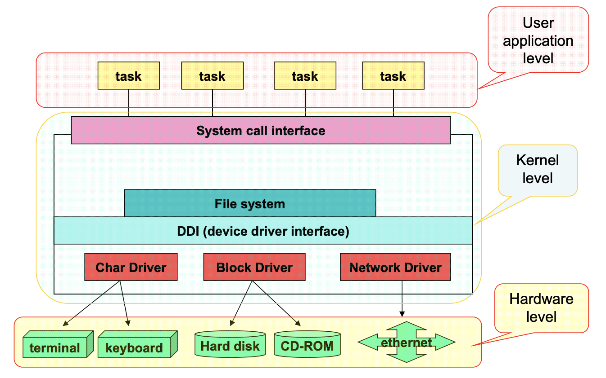

: 컴퓨터 하드웨어와 소프트웨어 자원을 관리하는 시스템 소프트웨어

### 운영체제의 구성요소

커널: 가장 핵심적인 역할. 하드웨어, 어플리케이션, 프로세스 관리  

#### 커널이 하는 일
프로그램과 실행과 멀티태스킹  
인터럽트: 프로세스 실행 도중에 예기치않은 상황이 발생했을 때 발생한 상황을 처리한 후 실행한 작업으로 돌아오는 것  
&emsp;하드웨어로부터의 요청  
	인터럽트 서비스 루틴 (isr)
 

디바이스 드라이버: 각각의 디바이스를 처리할 수 있는 코드들이 들어있는 작은 시스템 소프트웨어.  
운영체제와 같이 동작을 함

 

 

메모리 관리: HDD에 있는 프로그램들을 Memory에 load 하고 cpu 가 메모리에 있는 코드를 가져다 실행.  

파일시스템: HHD, SSD, USB 등등의 저장장치에 파일의 단위로 저장. 저장장치의 빈 공간 등을 논리적으로 관리하는 시스템.  

네트워킹: 네트워크 스택이 네으퉈크를 할 수 있도록 도와줌. tcp, ip, stack이 네트워크 파트 쪽에서 쉽게 인터넷을 할 수 있도록 운영체제의 레이어에서 제공.  

사용자 인터페이스: 사용자로부터 명령을 받아서 처리하고 그 결과를 사용자에게 주는 것
