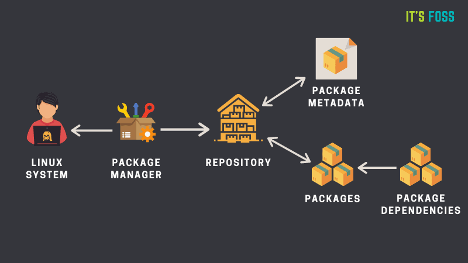
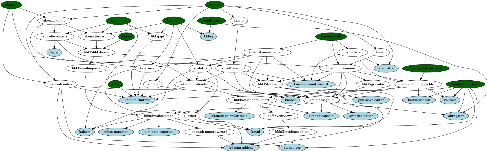
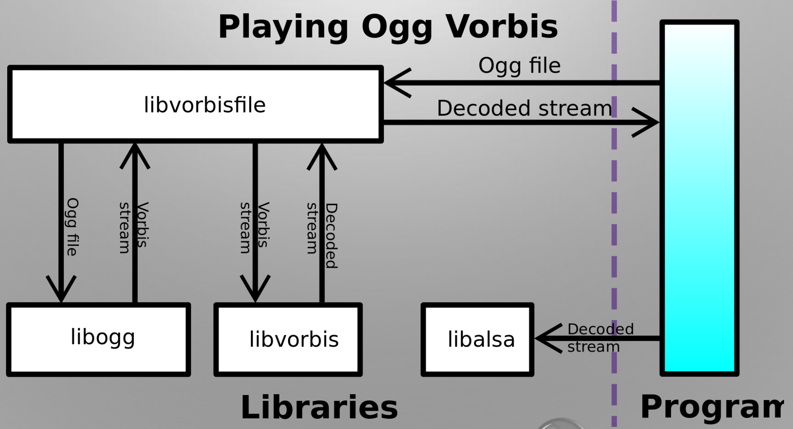

# Package Management System

소프트웨어 패키지를 관리하는 시스템.  
운영체제를 위해 일정한 방식으로 컴퓨터 프로그램의 설치, 업그레이드, 구성, 제거 과정을 자동화  

### 패키지간 의존성

ex) A가 있으려면 B가 있어야 하고, C가 있어야하고 ...  

## 라이브러리 동적 로딩과 의존성
라이브러리: 소프트웨어를 개발할 때 컴퓨터들이 사용하는 비휘발성 자원의 모임  

## 정적 라이브러리와 동적 라이브러리

### 정적 라이브러리
<strong>링킹단계</strong>에서 라이브러리가 제공하는 코드를 복사하여 실행파일에 넣는 방식  

> <strong>링킹</strong>: 여러 개의 코드와 데이터를 모아서 연결하여 실행될 수 있는 한 개의 파일을 만드는 작업. 메모리에 적재될 수 있음

#### 장점
- 런타임 시 외부를 참조할 필요가 없어 속도가 빠름

#### 단점
- 다른 프로그램이 같은 라이브러리를 참조할 경우 메모리 낭비
- 라이브러리 변경이 필요할 때, 변경된 라이브러리만 재배포 하는 것이 아니라 프로그램 자체를 재배포 해야 함

### 동적 라이브러리
링커가 라이브러리를 복사하지 않고 해당 내용의 주소만 가지고 있다가, <strong>런타임 시</strong> 해당 주소에서 필요한 내용을 가져오는 방식

#### 장점
- 라이브러리 파일을 포함하지 않기 때문에 실행파일의 크기가 작음
- 여러 프로그램이 하나의 메모리에 있는 동적 라이브러리를 공유하여 사용할 수 있기 때문에 효율적인 메모리 사용 가능
- 라이브러리 수정 시 라이브러리만 재컴파일하여 재배포 가능

#### 단점
- 외부 의존도가 생겨 이식성이 낮음
- 런타임 시 라이브러리가 저장된 주소로 이동하는 과정때문에 성능 저하가 발생할 수 있음

> <strong>이식성</strong>: 서로 다른 실행 환경의 시스템 간에 프로그램을 옮겨 실행할 수 있는 것.  
ex) 윈도우에서 실행하는 프로그램을 리눅스에서 실행할 수 있다면, 이식성이 높다고 봄