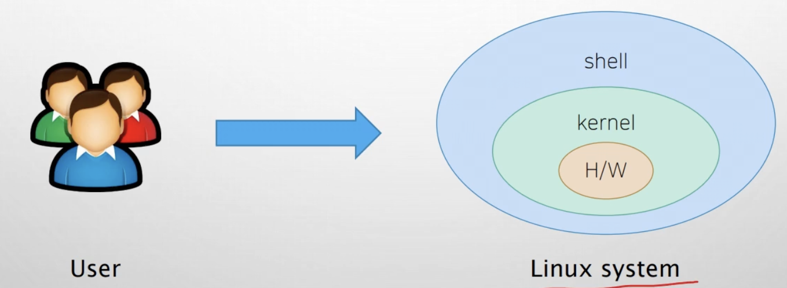
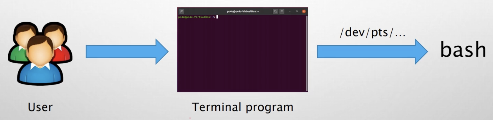
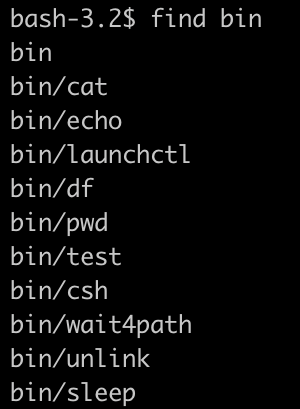
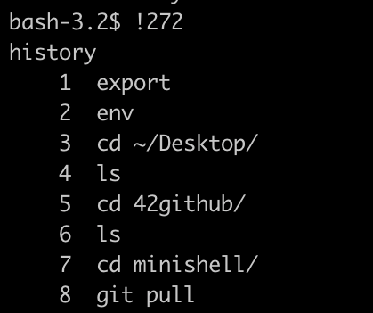

# 리눅스 터미널

쉘: 커널과 사용자를 연결해주는 인터페이스. 사용자가 시스템을 이용하기 위해 쉘로 접근해서 이용할 수 있음



터미널: 터미널을 통해 bash 라는 리눅스 쉘 프로그램을 이용할 수 있음



SSH 를 이용하여 인터넷을 넘어 리눅스 서버에 원격으로 접근할 수 있다. <br>
cf) telnet: 암호화 되지 않아 정보가 그대로 노출되어있음. 보안 취약함 <br>

CLI(Command Line Interface): 명령어를 기반으로 동작시킴 <br>

docker: 리눅스의 응용 프로그램들을 프로세스 격리 기술들을 이용해 컨테이너로 실행하고 관리하는 오픈소스 프로젝트

---

# 디렉터리 내용 조회/이동/확인
리눅스는 파일이 트리구조로 구성되어있음 <br>
~: 홈 디렉터리(사용자에게 할당된 개인 디렉터리) <br>
cd with no options: home dir 로 돌아옴 <br>
cd -: 직전 디렉터리로 돌아가기 

---

# 파일 내용 조회
### 파일의 일부분만 조회하기
head: 파일의 앞부분만 조회 <br>
tail: 파일의 뒷부분만 조회 <br>
얼만큼 보여줄지는 옵션으로 해결 가능. 기본은 10줄. <br>
옵션: -n [줄 수] <br>

---

# 파일 내용 검색
파일에서 특정 텍스트가 포함된 라인 찾기 <br>
grep [찾을 문자열] [문자열을 찾을 파일] <br>

우분투 터미널에서 마우스로 드래그 하는 순간 클립보드에 저장이 되어서 복사 가능

---

# 파일 검색
내가 원하는 파일이 어디있는지 찾는 법 <br>
find: 지정하는 디렉토리 이하에 있는 파일 검색 <br>
기본 옵션: -print <br>



-> bin 디렉터리 이하의 모든 파일 출력 <br>
*.conf 와 같이 와일드카드 사용 가능 <br>

이름으로 찾는 법 <br>
ex) find /etc -name [찾을 이름] -print <br>

파이프 이용하기 <br>
find | grep [찾을 이름]

### 파일의 경로 표현하기
절대경로: root 디렉터리부터 쓰기 <br>
```
/xyz/abc
```
상대경로: . .. 과 같이 나의 현재 위치에 따라 달라지는 경로 <br>
```
../abc
```

---

# 압축 관련 커맨드
```
find . > filelist
```

find 의 결과물을 filelist 라는 파일에 저장해라. <br>

리눅스에서 자주쓰는 파일 압축 <br>
gzip <br>
```
// 압축하기
gzip [option] [file]

// 압축해제
gunzip [파일이름]
```

```
// 파일에 대한 설명. 해당 파일이 어떤 파일인지 알려줌
file [파일명]
```

윈도우: 파일의 확장자와 애플리케이션을 연결해놓고 특정 확장자를 가진 파일을 했을 때의 액션 지정 <br>
ex) *.docx 파일을 열면 MS Office document 를 통해 파일이 열림 <br>
리눅스: 확장자라는 개념이 없음 <br>

여러 파일과 디렉터리가 있는 경우 <br>
tar.gz와 .tgz 을 많이 사용 <br>

### tar
대상이 되는 여러개의 파일을 붙여서 하나의 파일로 연결해줌. 단, 압축을 해주는 것은 아님 <br>
그 후 하나의 파일이 된 것을 .gz 로 압축 <br>
```
tar -cf archieve.tar foo bar
// -c(compress): foo 와 bar 에 있는 파일로부터 archieve.tar 라는 것을 만듦
// -f: 뒤에 나올 파일 이름으로 만들어라
[more options]
//-z: gzip으로 압축해라
// 단, 더 많은 옵션을 붙일 때는 f 옵션이 가장 뒤에 와야 함

tar -tvf archieve.tar
// -t(list): archieve.tar 에 있는 파일의 리스트 보여주기

tar -xf archieve.tar
// -x(extract): 압축해제. 다시 foo 와 bar 이라는 파일이 생김
```

# 시간 및 기타 커맨드
date: 시스템 시간 출력. 시간 변경도 가능

```
date [옵션] [포맷]
// ex) date %Y -> 2021
```

```
// 캘린더
cal

//options
cal -d 1999-03
cal -A 2 // 현재 월 ~ + 2개월까지의 달력
cal -B 2 // 현재월 - 2개월 ~ 현재까지의 달력
```

```
// 내가 썼던 명령어 검색
history

// 검색 후 
![명령어 번호] // 해당 명령어 실행

!! // 직전 command
```



```
// 쉘 끝내기 
exit
```

```
echo [변수명] // 변수명 출력
```

명령어를 치면 path 에서 지정한 디렉터리에 모두 가보고 해당 명령어가 있는지 없는지 확인 후 있으면 실행, 없으면 에러 <br>

환경변수: 프로세스가 컴퓨터에서 동작하는 방식에 영향을 미치는 동적인 값들. 쉘이 자동으로 관리하는 변수들이다. <br>

```
// 환경변수와 그 값들을 보여주는 명령어
env

// 명령어 경로 조회
which [명령어]
```

---

# 관리자 권한 실행
root: 관리자 계정 <br>
sudo: 일반 사용자가 root 권한을 잠시 빌려 명령어 실행

---

# 패키지 매니저 사용법 (apt)
사용자 -> 패키지매니저 -> 레포지토리 <br>

package manager: repository 에서 패키지 검색, 설치, 삭제, 조회 등 <br>

종류 <br>
ubuntu: apt <br>
CentOS: yum <br>

```
// 설치
sudo apt install [패키지 이름]

// 삭제
sudo apt remove [패키지 이름]

// 사용하지 않는 패키지 자동으로 전부 삭제
sudo apt autoremove [패키지 이름]

// 패키지 이름을 기반으로 패키지 나열
list
```
