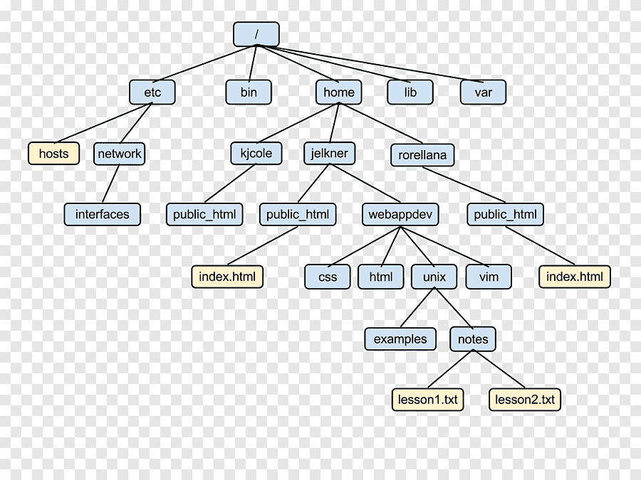

# 파일
데이터를 담는 그릇과 같다. 비휘발성 장치인 디스크에 저장  
cf) 변수: 메모리에 저장. 프로그램에서 데이터 사용할 때 사용  

 
## 파일시스템
파일을 관리하기 위한 시스템. 운영체제에서 저장장치에 있는 파일들을 구성하고 관리하는데 사용하는 구조  
운영체제 -> 파일시스템 -> dir -> file

## 트리구조

모든 디렉토리는 root 의 하위에 위치.  
cf) 윈도우: c,d,e 드라이브에 각각 파일 존재

 
> mount: 물리적인 장치를 특정한 위치(대게는 디렉토리)에 연결시켜주는 과정.

### 리눅스 파일시스템 종류
EXT2, EXT3, EXT4, XFS 등

---

1. 운영체제 안에 파일시스템이 있어야 함

2. 파일시스템의 종류에 따라 여러 특성들이 있음  
	ex) 한 파일의 최대크기, 최대 디스크 사이즈 등이 달라질 수 있음. 디스크의 종류에 따라 파일시스템의 특성이 달라질 수도 있음

 