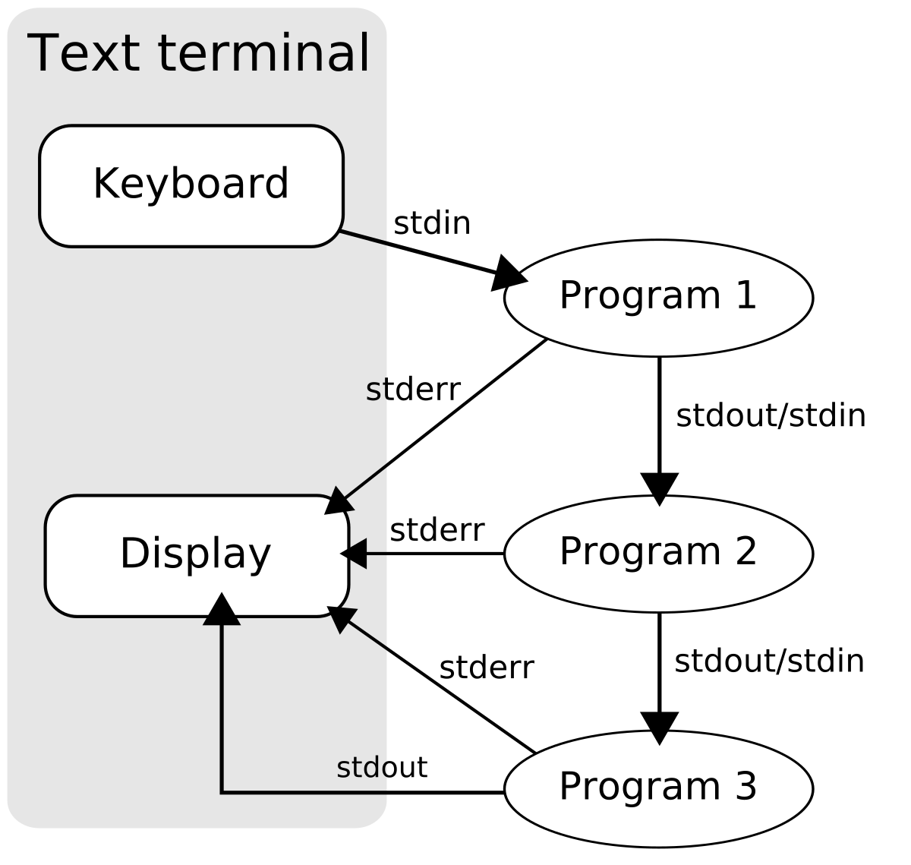

## Standard Streams

#0 stdin  
#1 stdout  
#2 stderr  

### File Descriptor
리눅스 혹은 유닉스 계열의 시스템에서 프로세스가 파일을 핸들링할 때 사용하는 것으로, 운영체제가 특정 파일에 할당해주는 정수 값. 파일을 대변하는 객체.  

파일에 대한 작업(읽기, 쓰기)을 하기 위해서는 파일 디스크립터를 열어야 함  
프로세스로 열린 파일 디스크립터 목록 관리