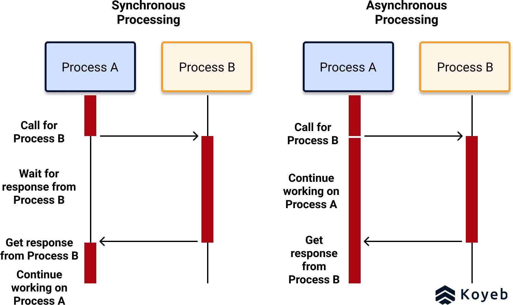
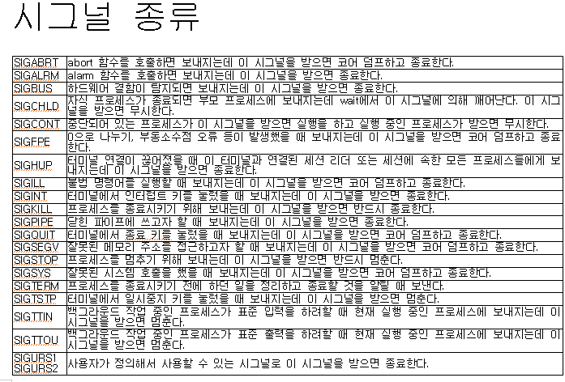

## 시그널
: 비동기 이벤트를 처리하기 위한 프로세스 간 통신  
signal number 알려줌, 각 signal 에 맞게 핸들링  

> 동기 방식: client 가 server 에 요청을 보내고 기다리는 방식
비동기 방식: client 는 다른 일을 하고 있다가, server 에게 response 가 오면 처리하는 방식

#### SIGINT
Ctrl + C 로 사용자가 인터럽트 생성

#### SIGTERM
프로세스 종료 명령. (프로세스 상태, 동작 방식 등 조건에 따른 처리 가능)

#### SIGKILL
강제 종료

#### SIGCHLD
자식 프로세스 종료

#### SIGABRT
코어덤프로 기본 처리.  

코어파일: 프로세스 또는 응용 프로그램이 비정상적 종료를 할 때 메모리 상태를 저장하는 파일  
코어덤프: 코어파일을 만드는 행위