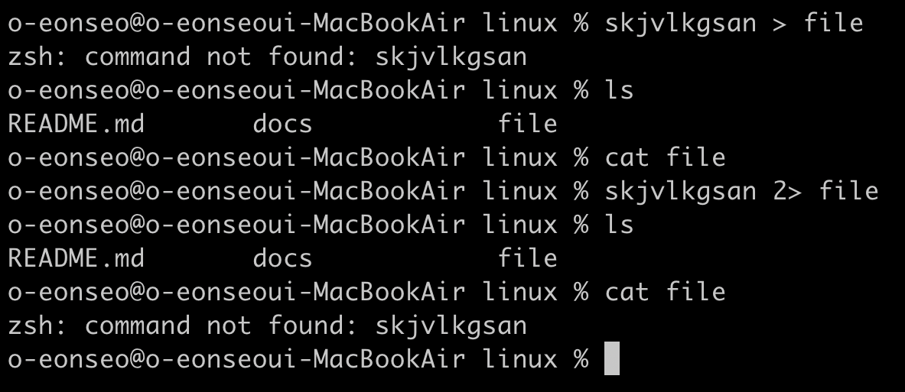

## 파일 디스크립터로 리디렉션 >&

```
[n] >& [FD]
```



'>'와 동일하지만 대상 파일 대신 대상 파일 디스크립터 지정 <br>
표준 출력과 표준 에러를 한 번에 출력하고 싶을 때 자주 사용

## 표준 출력 및 표준 에러 동시 리디렉션 &>

```
&> filename
```


표준 출력이든 에러든 filename 으로 다 보냄 <br>
stderr 를 stdout 으로 리디렉션